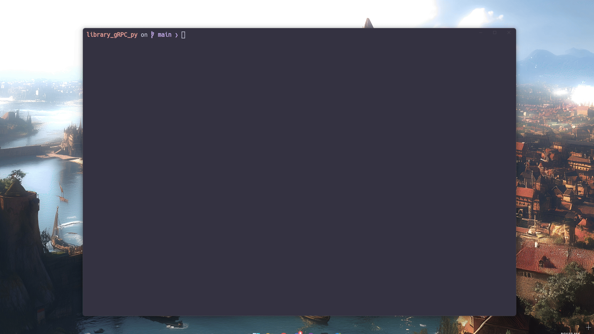

Cross-platform terminal and editor setup, using WezTerm, Neovim, Zsh, and Starship



## Neovim

Full support (language server, completion, format on save) for Python, Go, Rust, and Lua, with syntax highlighting for Bash, JSON, YAML, TOML, and Markdown

Plugins:
- **Plugin manager:** [lazy.nvim](https://github.com/folke/lazy.nvim)
- **Language servers:** [nvim-lspconfig](https://github.com/neovim/nvim-lspconfig), [mason.nvim](https://github.com/williamboman/mason.nvim), [mason-lspconfig.nvim](https://github.com/williamboman/mason-lspconfig.nvim), [rustaceanvim](https://github.com/mrcjkb/rustaceanvim), [crates.nvim](https://github.com/saecki/crates.nvim)
- **Completion and snippets:** [nvim-cmp](https://github.com/hrsh7th/nvim-cmp), [cmp-nvim-lsp](https://github.com/hrsh7th/cmp-nvim-lsp), [cmp-buffer](https://github.com/hrsh7th/cmp-buffer), [cmp-path](https://github.com/hrsh7th/cmp-path), [LuaSnip](https://github.com/L3MON4D3/LuaSnip), [cmp_luasnip](https://github.com/saadparwaiz1/cmp_luasnip), [friendly-snippets](https://github.com/rafamadriz/friendly-snippets)
- **Syntax:** [nvim-treesitter](https://github.com/nvim-treesitter/nvim-treesitter)
- **Navigation:** [telescope.nvim](https://github.com/nvim-telescope/telescope.nvim), [harpoon](https://github.com/ThePrimeagen/harpoon/tree/harpoon2), [nvim-tree.lua](https://github.com/nvim-tree/nvim-tree.lua)
- **Key hints and statusline:** [keyhints.nvim](https://github.com/imad-shah/keyhints.nvim), or [which-key.nvim](https://github.com/folke/which-key.nvim) & [lualine.nvim](https://github.com/nvim-lualine/lualine.nvim)
- **Editing and UI:** [nvim-autopairs](https://github.com/windwp/nvim-autopairs), [neoscroll.nvim](https://github.com/karb94/neoscroll.nvim), [nvim-highlight-colors](https://github.com/brenoprata10/nvim-highlight-colors), [markdown-preview.nvim](https://github.com/iamcco/markdown-preview.nvim), [nvim-web-devicons](https://github.com/nvim-tree/nvim-web-devicons), [plenary.nvim](https://github.com/nvim-lua/plenary.nvim)
- **Colorschemes:** [onedark.nvim](https://github.com/navarasu/onedark.nvim), with [rose-pine](https://github.com/rose-pine/neovim), [flow.nvim](https://github.com/0xstepit/flow.nvim), and [dracula.nvim](https://github.com/Mofiqul/dracula.nvim) commented out for switching

## Setup

Clone to `~/dotfiles` (`.zshrc` expects it there), move any existing configs out of the way, then link them in

macOS and WSL:

```sh
git clone https://github.com/imad-shah/dotfiles.git ~/dotfiles
mkdir -p ~/.config
ln -s ~/dotfiles/config/nvim ~/.config/nvim
ln -s ~/dotfiles/config/starship.toml ~/.config/starship.toml
ln -s ~/dotfiles/zsh/.zshrc ~/.zshrc
ln -s ~/dotfiles/config/wezterm ~/.config/wezterm  # macOS only
```

Windows, where WezTerm runs outside WSL (PowerShell, with Developer Mode on):

```powershell
New-Item -ItemType SymbolicLink -Path "$HOME\.config\wezterm" -Target "\\wsl.localhost\FedoraLinux-42\home\<user>\dotfiles\config\wezterm"
```
